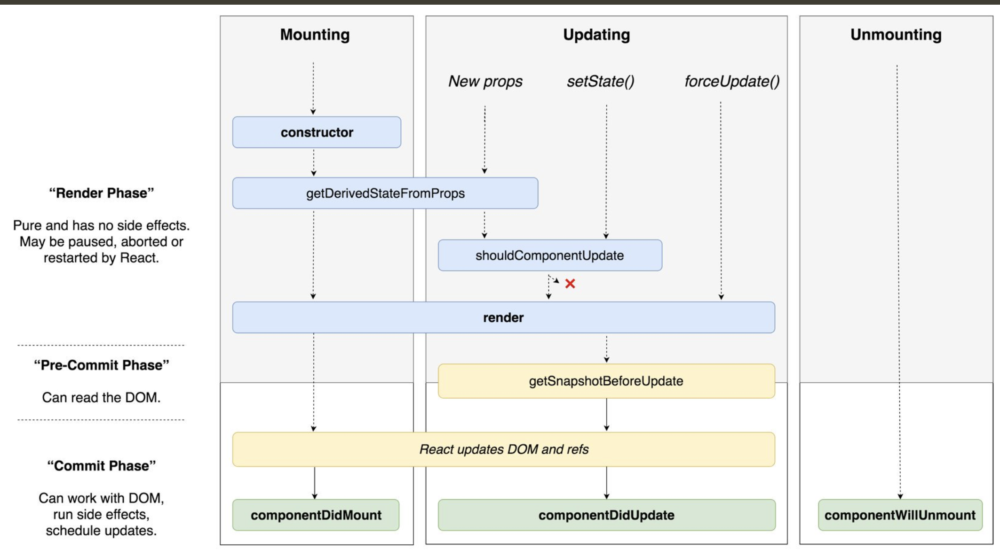

# React Workshop 1

1. React fundamentals

   - [Official documentations](https://reactjs.org/docs) (Recommanded reading)
   - [JSX, syntax extension to JavaScript](https://reactjs.org/docs/jsx-in-depth.html)

   ```js
   const reactElement = <h1 className="greeting">Hello, world!</h1>;
   const reactElement = React.createElement(
     "h1",
     { className: "greeting" },
     "Hello, world!"
   );
   const reactElement = {
     type: "h1",
     props: {
       className: "greeting",
       children: "Hello, world!"
     }
   };
   // React elements are descriptions of what you want to see on the screen
   // React reads these objects and uses them to construct the DOM and keep it up to date
   ```

   - [Lifecycle](https://reactjs.org/docs/state-and-lifecycle.html)
     
     [Illustraion by Dan Abramov](https://twitter.com/dan_abramov/status/981712092611989509?lang=en)

     ```
     render → reconcilitation → commit
          ↖                       ↙
               state change
     ```

     - Render (Create element)
     - [Reconcilitation](https://reactjs.org/docs/reconciliation.html) (Compare elements with previous render)
     - Commit (Update the DOM if needed)

   - [Uncontrolled VS. Controlled component](https://goshakkk.name/controlled-vs-uncontrolled-inputs-react/)
     > A form element becomes “controlled” if you set its value via a prop. That’s all.
   - [Why is immutability important](https://reactjs.org/tutorial/tutorial.html#why-immutability-is-important)
   - [Think in React](https://reactjs.org/docs/thinking-in-react.html)

2. Important concepts

   - [Writing resilient components](https://overreacted.io/writing-resilient-components/)
     - [Don’t stop the data flow.](https://overreacted.io/writing-resilient-components/#principle-1-dont-stop-the-data-flow) Props and state can change, and components should handle those changes whenever they happen.
     - [Always be ready to render.](https://overreacted.io/writing-resilient-components/#principle-2-always-be-ready-to-render) A component shouldn’t break because it’s rendered more or less often.
     - [No component is a singleton.](https://overreacted.io/writing-resilient-components/#principle-3-no-component-is-a-singleton) Even if a component is rendered just once, your design will improve if rendering twice doesn’t break it.
     - [Keep the local state isolated.](https://overreacted.io/writing-resilient-components/#principle-4-keep-the-local-state-isolated) Think about which state is local to a particular UI representation — and don’t hoist that state higher than necessary.
   - Best practices are created base on people's exeperiences and changes over time
   - Understand reasons behind rules/best practices and form your opinions overtime
   - React components organization often comes down to maintainability, scalability, and not coding for the unforeseeable future requirements

3. [Hooks](https://reactjs.org/docs/hooks-intro.html)

   - > Hooks are functions that let you “hook into” React state and lifecycle features from function components. Hooks don’t work inside classes — they let you use React without classes.
   - 100% backward-compatible and completely opt-in
   - Enables sharing of state management and (lifecycle) effects in function components
   - Developers are encouraged to write new components in function and use hooks when necessary
   - Existing class components don't need to convert to function unless it makes future development easier
   - Hooks should be declared at the beginning of a function component and orders cannot change during runtime
   - [Is there something like instance variables?](https://reactjs.org/docs/hooks-faq.html#is-there-something-like-instance-variables)
   - [Hooks API](https://reactjs.org/docs/hooks-reference.html)

4. [Context](https://reactjs.org/docs/context.html)

   - Context provides a way to pass data through the component tree without having to pass props down manually at every level
   - Apply it sparingly because it makes component reuse more difficult
   - Every update to a context value causes consumers of the context to re-render
   - A good way to use context api is to use it as read only global state
   - [Caveats](https://reactjs.org/docs/context.html#caveats)
     - Context uses reference identity to determine when to re-render
     - Make sure context provider value is [changed without mutation](https://reactjs.org/tutorial/tutorial.html#data-change-without-mutation)
   - Deprecated legacy context api may cause unnecessary re-rendering (Prefer new context api)
   - Updating context with legacy context api is [not reliable](https://reactjs.org/docs/legacy-context.html#updating-context)
   - [Context demo](https://codesandbox.io/s/inspiring-rgb-g5w1d?fontsize=14)

5. Render
   - [Simple Tip to optimize re-rendering](https://kentcdodds.com/blog/optimize-react-re-renders)
   - [Fix slow render before fixing slow re-render](https://kentcdodds.com/blog/fix-the-slow-render-before-you-fix-the-re-render)
6. Testing

   - Avoid using test hooks to reuse logics ([Ken C.
     Dodds](https://kentcdodds.com/blog/avoid-nesting-when-youre-testing), [Shopify Testing](https://github.com/Shopify/web-foundation/blob/master/Best%20practices/Testing.md#setup-perform-assert))
     > Prefer factory functions for setting up variables under test rather than doing so in beforeEach/ setup blocks, except for mocks of globals (for the environment, or mocks of the module system) that must be restored in between tests.
   - [Consider writing more integration tests](https://kentcdodds.com/blog/write-tests)

7. Fun read :)
   - [React as a UI Runtime](https://overreacted.io/react-as-a-ui-runtime/)
   - [The Elements of UI Engineering](https://overreacted.io/the-elements-of-ui-engineering/)
   - [Functional-Light JavaScript](https://github.com/getify/Functional-Light-JS)
