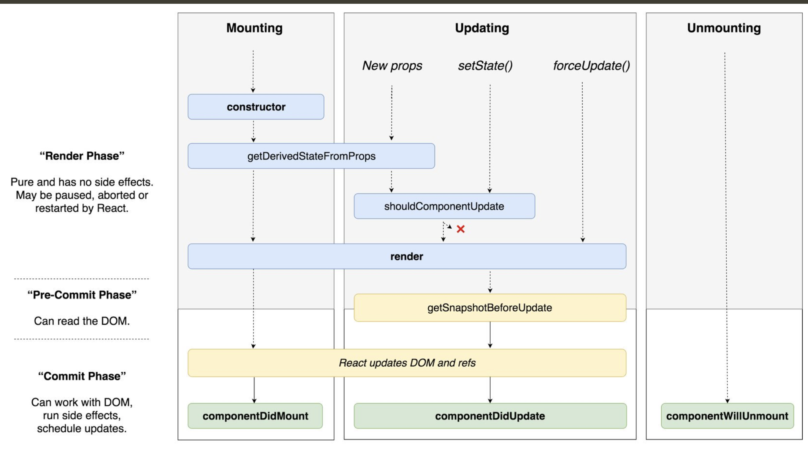

# React Workshop 3: Performance

## Concepts

### Jank

> Most devices today refresh their screens 60 times a second. If there’s an animation or transition running, or the user is scrolling the pages, the browser needs to match the device’s refresh rate and put up 1 new picture, or frame, for each of those screen refreshes. Each of those frames has a budget of just over 16ms (1 second / 60 = 16.66ms). In reality, however, the browser has housekeeping work to do, so all of your work needs to be completed inside 10ms. When you fail to meet this budget the frame rate drops, and the content judders on screen. This is often referred to as jank, and it negatively impacts the user’s experience. - Paul Lewis on Rendering Performance

### How React updates DOM

> A "render" is when React calls your function to get React elements.
>   
> "Reconciliation" is when React compares those React elements with the previously rendered elements.
>   
> A "commit" is when React takes those differences and makes the DOM updates.
>   - Kent C. Dodds on React Render

### Perceived performance

User's perception of how fast the website seems to the user.

[MDN doc](https://developer.mozilla.org/en-US/docs/Learn/Performance/perceived_performance)

### Time to Interactive

A page load performance metric that measures how long it takes for a web page to become interactive

[WICG definition](https://github.com/WICG/time-to-interactive#time-to-interactive-explainer)

## Rule of thumb

- Disable browser dev extensions prior to profiling to get more accurate result (EX: Redux/GraphQL dev tool)
- Profile performance before optimization
- React's experimental concurrent mode may pause and resume rendering of components base on priorities.
  It's critical to [fix slow render before fixing slow re-render](https://kentcdodds.com/blog/fix-the-slow-render-before-you-fix-the-re-render).

## Profiling

- [Profiling Components with the Chrome Performance Tab](https://reactjs.org/docs/optimizing-performance.html#profiling-components-with-the-chrome-performance-tab)
- [Profiling React performance with React 16 and Chrome Devtools](https://building.calibreapp.com/debugging-react-performance-with-react-16-and-chrome-devtools-c90698a522ad)
- [Profiling Components with the DevTools Profiler](https://reactjs.org/docs/optimizing-performance.html#profiling-components-with-the-devtools-profiler)

## Optimization

- [Official doc - Optimizing Performance](https://reactjs.org/docs/optimizing-performance.html)
- Memoize expansive calculation to reduce rendering time
- Defer unnecessary work until component mounted/updated unblocks the main thread and reduced unwanted jank when rendering
- [Pass expensive components down as element props to avoid re-render when ancestor components re-render](https://kentcdodds.com/blog/optimize-react-re-renders)
- Use `PureComponent` or `React.Memo` to avoid re-render when ancestor components re-render
- [Virtualization of long list](https://reactjs.org/docs/optimizing-performance.html#virtualize-long-lists)

## Case studies

- [Twitter Lite and High Performance React Progressive Web Apps at Scale](https://medium.com/@paularmstrong/twitter-lite-and-high-performance-react-progressive-web-apps-at-scale-d28a00e780a3)
- [A Netflix Web Performance Case Study](https://medium.com/dev-channel/a-netflix-web-performance-case-study-c0bcde26a9d9)
